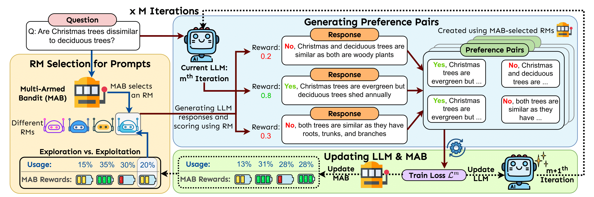

# [LASeR: Learning to Adaptively Select Reward Models with Multi-Arm Bandits]()

[Duy Nguyen](https://duykhuongnguyen.github.io/)\*, [Archiki Prasad](https://archiki.github.io/)\*, [Elias Stengel-Eskin](https://esteng.github.io/), and [Mohit Bansal](https://www.cs.unc.edu/~mbansal/) (\*equal contribution).




## Installation
This project is built on Python 3.10.11. All dependencies can be installed via:

`pip install -r requirements.txt`

## Project Directory Structure
The project directory is as follows:

```
scripts/
├── dataset/
    ├── strategyqa/
    ├── gsm8k/
    └── mmlu/
├── model/
    ├── __init__.py
    └── response_generator.py
├── utils/
    ├── __init__.py
    ├── config_loader.py
    ├── dataset_manager.py
    ├── linucb.py
    ├── llm_trainer.py
    ├── preference_pair_generator.py
    └── reward_model.py
├── config.yaml
├── train_and_infer.py
├── run_training.sh
└── run_training_all.sh
```

## Running LASeR

### Run LASeR on reasoning tasks
Run LASeR on one dataset, for example StrategyQA:

```bash 
cd scripts
bash run_training.sh strategyqa
```

Run all datasets 
```bash
cd scripts
bash run_training_all.sh
```

You can change the training setup in ```scripts/config.yaml```

### Run LASeR on instruction-following tasks
Coming soon

### Run LASeR on long-context understanding tasks
Coming soon

## Citation
```
@article{nguyen2024laser,
  title={LASeR: Learning to Adaptively Select Reward Models with Multi-Arm Bandits},
  author={Nguyen, Duy and Prasad, Archiki and and Stengel-Eskin, Elias and Bansal, Mohit},
  journal={arXiv},
  year={2024}
}
```